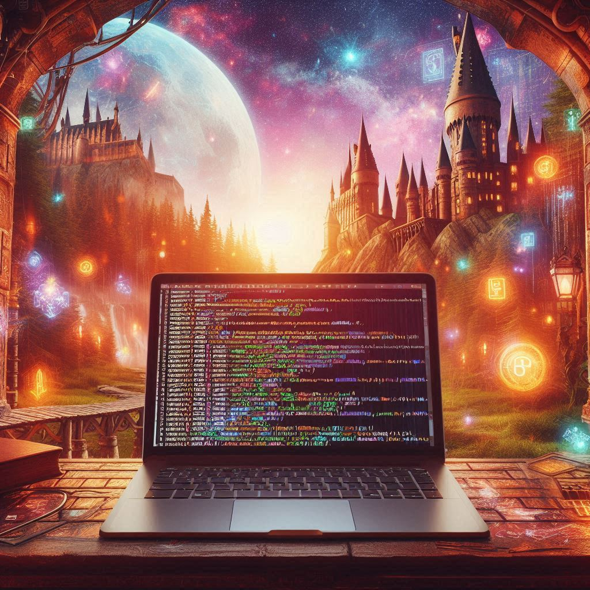

    preview do podcast

    <audio src="output/podCast.MP3" controls title="Podcast editado"></audio>

# Projeto Podcast Gerado por I.A.s

 > ℹ️ **NOTE:** Este é o repositório desenvolvido durante um BootCamp da [DIO](https://dio.me)

Projeto com o objetivo de gerar um podcast utilizando ferramentas de IA através de prompts mais trabalhado.

Utilizer uma esteira de prompts para gerar cada etapa do processo criativo.

## 💻 Tecnologias utilizadas no projeto

- [ChatGPT](https://chat.openai.com/) 
- [Microsoft Designer](https://designer.microsoft.com/image-creator)
- [ElevenLabs](https://beta.elevenlabs.io/)

## ✨ Como foi feito ?

- Roteiro gerado via chatgpt
- Audio gerado pela elevenLabs
- Microsoft Designer Para gerar capas

---
